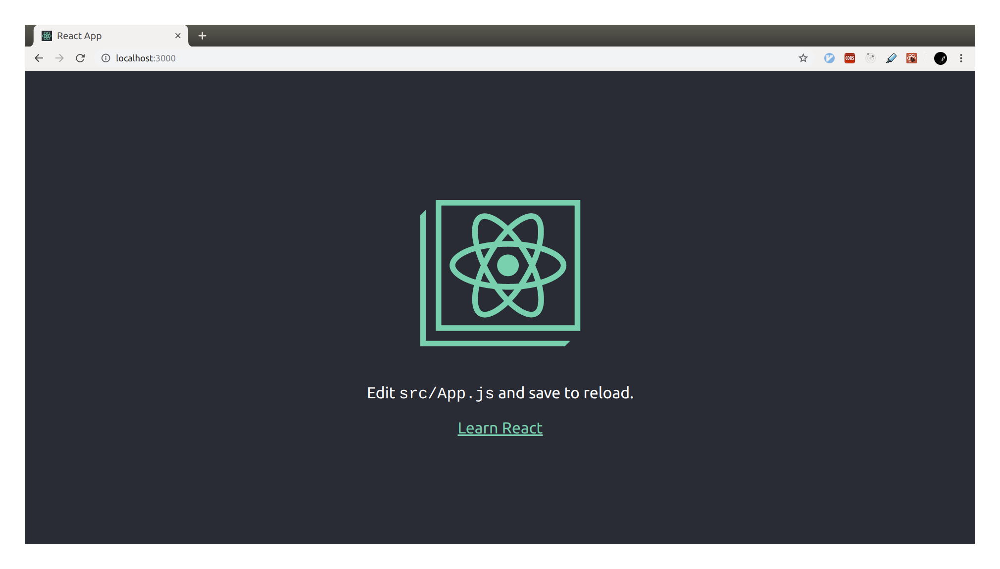
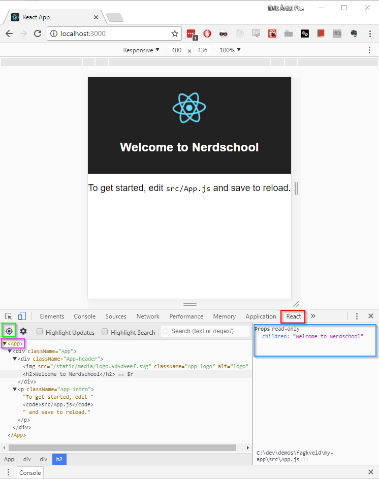

# Exercise 1 - Getting Started

## In this exercise you will learn to:

- Create a new React app using the scaffolding tool `create-react-app`.
- Learn about "hot reloading" aka how we get the browser to automatically reload code changes on the fly (without reloading the page).
- Incorporate styling (Sass).
- Get linting in your editor.

## Required software and tools

- Google Chrome.
- A modern text editor that understands JavaScript and React. For example Atom or Visual Studio Code.
- [NodeJS and npm](https://nodejs.org/en/) installed on your machine. **You need to have NodeJS 8.10.0 or later (`node -v`) and npm 5.2.0 or later (`npm -v`) installed.**

## 1.1 Creating a new React application

:book: Creating a new React application from scratch can be a surprisingly long and tedious task these days. A typical React application uses [Webpack](https://webpack.js.org/) as the main build tool and pipeline.

:book: Instead of setting up Webpack from scratch, we're going to use a scaffolding tool called [`create-react-app`](https://facebook.github.io/create-react-app/) which will generate a Webpack project for us, and manage all configuration files for us in a different folder on your machine. This means you won't see the configuration files that belong to your app.

:bulb: In a real-world application of some size you'll probably want control over these configuration files - and Webpack. In that case you can either set everything up yourself from scratch or scaffold a project using `create-react-app` and _eject_ to take control over the configuration files and dependencies. (An app made using `create-react-app` is good enough for real-world production, it's not just a demo setup).

### create-react-app

> For reference and docs: [create-react-app on GitHub](https://github.com/facebookincubator/create-react-app)

:pencil2: Open up a bash terminal window and create a folder in your home folder called `react-projects`.

:bulb: If you are on Windows, use [Git Bash](https://gitforwindows.org/).

```bash
$ mkdir ~/react-projects
$ cd ~/react-projects
```

> :exclamation: If you already have `create-react-app` installed, check your version and ensure you're on v2 or later (`create-react-app --version` in your terminal). Upgrade your `create-react-app` version by doing `npm i -g create-react-app` in your terminal, then verifying it went ok by doing `--version` again. If you don't have `create-react-app` installed already, then running the next command below will install it for you.

:pencil2: Run `npx create-react-app nerdschool-app`. This will create the new React application "nerdschool-app" in the `react-projects`-folder:

(`npx` is a [package runner tool that comes with >npm 5.2+](https://medium.com/@maybekatz/introducing-npx-an-npm-package-runner-55f7d4bd282b).)

```bash
$ npx create-react-app nerdschool-app
npx: installed 63 in 5.715s

Creating a new React app in /Users/nerdschool/react-projects/nerdschool-app.

Installing packages. This might take a couple of minutes.
Installing react, react-dom, and react-scripts...
...
Success! Created nerdschool-app at /Users/nerdschool/react-projects/nerdschool-app
```

:pencil2: Run `npm start` from the `nerdschool-app` folder to start the app in your browser:

```bash
$ cd nerdschool-app
$ npm start
Compiled successfully!

You can now view nerdschool-app in the browser.

  Local:            http://localhost:3000/
  On Your Network:  http://192.168.1.129:3000/

Note that the development build is not optimized.
To create a production build, use npm run build.
```

A new browser window should start showing the default page:



:bulb: You can stop the development server by pressing <kbd>CTRL</kbd>+<kbd>C</kbd> in the terminal window.

### :book: Inspecting the generated files and folders

:book: Open the `nerdschool-app` folder in your code editor.

A simple folder structure was created by `create-react-app` inside the `nerdschool-app` folder:

```bash
├── README.md
├── node_modules
│   ├── ...
├── package-lock.json
├── package.json
├── public
│   ├── favicon.ico
│   ├── index.html
│   └── manifest.json
└── src
    ├── App.css
    ├── App.js
    ├── App.test.js
    ├── index.css
    ├── index.js
    ├── logo.svg
    └── serviceWorker.js
```

- `/public` - This folder contains files needed for running your app, but not necessarily something you want to change or modify as part of your other source code files. (`manifest.json` is a metadata file related to running your app as a [progressive web app](https://github.com/facebookincubator/create-react-app/blob/master/packages/react-scripts/template/README.md#progressive-web-app-metadata)).
- `/src/index.js` - This is the main entry point for your app. As you can see in the code, it'll look for a `div` named "root" which'll be the top-level DOM node for your React app. You'll find this `div` in `/public/index.html`. Also note that this file _imports_ the `App` React component from `/src/app.js` and passes it in to `ReactDOM.render(<App />)`.
- `/src/App.js` - This is currently the top-level React element in your app. Its content should be very straight-forward. Note that the html `class` attribute is called `className` in React. Also note that this component is a `class` that _extends_ the React `Component` base class.
- `/src/App.test.js` - These are the tests for `App.js`. In React apps it's common to put test files either next to the source file (in the same folder), or in a `__tests__` sub-folder next to the source file. Any file ending with `.test.js` or `.spec.js` will be identified as a test file by [**Jest**](https://jestjs.io/), which is our current test runner and test framework.

### Cleaning up stuff we won't use

:book: The downside to most code generators is that often they create stuff we don't need or don't understand. In this case we get some stuff related to progressive web apps which we won't use in this workshop.

:pencil2: Delete `src/serviceWorker.js`.  
:pencil2: Delete `public/manifest.json`.  
:pencil2: Open `src/index.js` and remove the following lines:

```diff
import React from 'react';
import ReactDOM from 'react-dom';
import './index.css';
import App from './App';
-import * as serviceWorker from './serviceWorker';

ReactDOM.render(<App />, document.getElementById('root'));
-
-// If you want your app to work offline and load faster, you can change
-// unregister() to register() below. Note this comes with some pitfalls.
-// Learn more about service workers: http://bit.ly/CRA-PWA
-serviceWorker.unregister();
```

## 1.2 Running tests and building

By inspecting `package.json` we can see four `scripts`:

- `start`
- `build`
- `test`
- `eject`

We already know what `start` does, and the others should be easy to guess.

:pencil2: Stop your running app (<kbd>CTRL</kbd>+<kbd>C</kbd>)

### Build

:pencil2: Run `npm run build`. After a few seconds, it says a bundle is compiled and ready inside the `/build` folder. This means Webpack took all of our files and bundled and minimized them into one js and one css file, ready to be deployed to production.

:pencil2: Run `npx serve -s build` and open [http://localhost:5000/](http://localhost:5000/). This command starts a small web server called [`serve`](https://github.com/zeit/serve#readme) which _serves_ your built production build.

:book: For the rest of the workshop we'll use `npm start` to serve our source files as-is through _webpack dev server_ - a special development web server which is configured behind-the-scenes for you by create-react-app. This makes it easier to debug and inspect our code in the browser dev tools and other development features.

:pencil2: You can stop serving the bundle by pressing <kbd>CTRL</kbd>+<kbd>C</kbd> in the terminal window. In your browser, make sure you're using port 3000 (the dev server) and not 5000: [http://localhost:3000/](http://localhost:3000/).

### Test

:book: We already know we have one test in `src/App.test.js`, so we assume running `npm test` will find and run it.

:pencil2: Run `npm test`. It should produce 1 green test passing. The command also entered _watch mode_ which'll re-run relevant tests when source files changes. It can be useful to leave this open in another terminal window while working.

If you get the below message in your terminal when running `npm test`, just press `a` to force a full test run.

```
No tests found related to files changed since last commit.
Press `a` to run all tests, or run Jest with `--watchAll`.
```

### Eject

**>>> Do not run :exclamation: :exclamation: <<<**

:book: As discussed briefly earlier, this command hands over control of our configuration files and puts them in our repository. This is not necessarily a bad thing - in a "real" project we probably want to do this at some point, but it's not necessary for this workshop.

## 1.3 Hot reloading

:book: There's a feature in Webpack called _Hot Module Replacement_ (HMR) which, through dark and mysterious magic, enables plugins and frameworks to be notified when certain pieces of the application code changes (when you save a file to disk).

For our purposes this means that when we change a React component while `npm start` is running, the tooling will automatically swap out that single React component with the newly compiled one you just saved without having to refresh the page in the browser. It's smart enough to not trigger a re-render of any React components not impacted by the change. We call this _hot reloading_.

> We can also enable this feature for Redux so that when a React component is changed, its internal state is transferred to the newly compiled version, giving you virtually no downtime when coding on a component. We won't use this feature in this workshop.

Let's try it out.

:pencil2: Make sure you have `npm start` running and a browser window open at [http://localhost:3000/](http://localhost:3000/). Put this window and your code editor side-by-side so you can see both at the same time.  
:pencil2: Open `src/App.js` and insert a new line at line 11 (over the `<p>` tag) with the following code: `<h1>Welcome to nerdschool</h1>`. Save the file.  
:book: Notice how the text in the webpage changed immediately without having to refresh the window.

As you might've guessed, this rapid feedback loop will soon become very addictive :)

## 1.4 Chrome extensions

There are some very useful Chrome extensions when working with React. Having these tools is part of why so many people prefer to work with React. We'll use them later on so please install them now.

### React Developer Tools

> [Download here](https://chrome.google.com/webstore/detail/react-developer-tools/fmkadmapgofadopljbjfkapdkoienihi?hl=en)

This is like any browser's _Elements_ tab, but for React elements.



**Useful things to note:**

:book: The right-hand panel (blue) lists a component's _props_. We haven't discussed this yet, but props are basically the values passed in to a component from it's parent component. This will be useful later.  
:book: The target icon (green) enables you to point your cursor on an element on the screen which'll expand down to, and select, that React component in the tree.  
:book: Note that this DOM-tree lists the React nodes as they are named in your source code (pink). This is extremely useful for debugging.

### Redux Dev Tools

> [Download here](https://chrome.google.com/webstore/detail/redux-devtools/lmhkpmbekcpmknklioeibfkpmmfibljd?hl=en)

We'll discuss this in later exercises. Just install it now :)

### [Go to exercise 2 :arrow_right:](../exercise-2/README.md)
