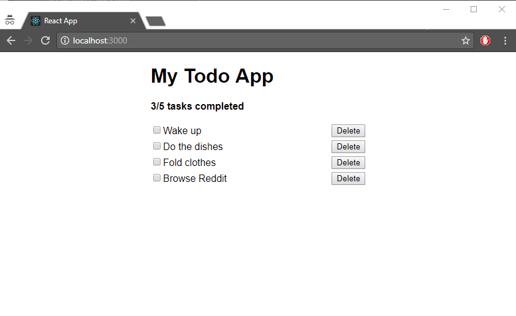

# Exercise 3 - React

## In this exercise you will learn to:

- Create React components using pure functions or pure components.
- Use Prop Types to be explicit about what data types and shape your component is expecting as _props_.

## Reminder: Todo app spec

Here's the spec for our todo app as discussed in the previous exercise, for reference.


### Header

- There will be an `h1` header for the name of this glorious app
- There will be a sub-header with slightly emphasized text stating how many total tasks there are and how many of those are completed.

### Adding a task

- There will be a textbox where a user can enter the description of a task
- There will be an "Add" button which will add the task to the list of existing tasks/todos.

### Listing todos

- There will be a list of todo items. Each todo item will consist of:
  - A checkbox with the description of the todo
  - An delete button which will remove the todo item permanently


1. `App`. Will contain the header text and the sub-components.
1. `Summary`. Will contain the total number of tasks and show how many of those are completed.
1. `AddTodo`. Will contain the textbox and Add-button.
1. `TodoList`. Will contain the list for all todo items.
1. `TodoItem`. Will contain a checkbox that marks a task as In Progress or Done, and a Delete button.

## Don't cheat

:exclamation: Now that we're about to dive into the code, please remember that it's always better to write the code yourself. Please do not copy & paste from the code examples in this text, write everything out manually.

## 3.1 - The `App` component

:book: Now that we have a basic understanding of what we want to make, let's dive right in and get started on the `App` component.

:pencil2: Open `App.js` and remove all of its content.  
:pencil2: All React components must import React in order to run, so start by adding the line `import React from 'react'`.  
:pencil2: Let's assume we only need App as a pure component and add the following:  

```jsx
const App = () => (
  <div>
    <h1>My Todo App</h1>
  </div>
);
```

> :bulb: Unless we know for sure we'll need lifecycle hooks, we tend to start new components as pure components and convert to class component if it turns out we need more complexity.

:pencil2: Then we need to finish up by exporting the component out of the module: `export default App`;

The header should now render to the screen.

For reference, here's the `App.js` file at this point:

```jsx
import React from 'react';

const App = () => (
  <div>
    <h1>My Todo App</h1>
  </div>
);

export default App;
```

Next, let's start on the list itself. For now, we'll work with dummy data.

## 3.2 - The `Summary` component

This is the component that will print out how many tasks we have registered and how many of those are completed. Here we'll obviously need some data, but at this stage we'll make the basic structure of the component and provide some dummy data. We'll switch to real data in a later exercise.

:pencil2: For simplicity, start by copying all content in `App.js` and make a new file `Summary.jsx` and paste the content in.  
:pencil2: Change the name of the component inside of `Summary.jsx` from _App_ to _Summary_.  

Now we need to decide what props we need. We have to options:

1. One `todosCount` prop and another `completedTodosCount` prop which'll be the respective numbers.
2. The list of all `todoItems`, then filter that list to find the total and completed numbers.

In this exercise we'll go with option 1 just to get the hang of using more prop and prop types. If you'd rather do option 2, feel free :+1: :+1:

:pencil2: Change the `Summary` function/component to take in the `todosCount` and `completedTodosCount` props, using the _destruct_ syntax:

```jsx
const Summary = ({ todosCount, completedTodosCount }) => (

);
```

Next, we'll write out the JSX.

:pencil2: Add the following:

```jsx
const Summary = ({ todosCount, completedTodosCount }) => (
  <div className="summary__container">
    <p className="summary__text">
      {`${completedTodosCount}/${todosCount} tasks completed`}
    </p>
  </div>
);
```

There's a few things going on here:

- We added some class names which we haven't defined yet. We'll use the [BEM](http://getbem.com/naming/) naming convention for SASS classes here. We won't cover this in detail, but feel free to read up on it - it'll take you 3 minutes.
- We used a fancy syntax to write text to the screen. The backticks-dollar-curly thing is the (relative) new JavaScript [template literals](https://developer.mozilla.org/en-US/docs/Web/JavaScript/Reference/Template_literals) feature. We wrap it in another set of curly brackets because this is plain JavaScript and not JSX and as discussed in exercise 2, we use curly brackets inside JSX evertime we want to write JavaScript inline.

:pencil2: To finish of the Summary component for now, we need to add prop type validation to our props:

```jsx
import PropTypes from 'prop-types';

/* Summary component here */

Summary.propTypes = {
  todosCount: PropTypes.number.isRequired,
  completedTodosCount: PropTypes.number.isRequired,
};

/* export component here */
```

:pencil2: Go back to App.js and _import_ and use the new `Summary` component:

```jsx
import Summary from './Summary';

const App = () => (
  <div>
    <h1>My Todo App</h1>
    <Summary todosCount={5} completedTodosCount={2} />
  </div>
);
```

### Styling

One of the cool things about React is how isolated we can make our components. From the outside we only need to worry about sending in the required props. The internals of the component will handle all other details, such as loading styling. Let's implement the two CSS classes we defined above to demonstrate this.

We'll use plain CSS today for simplicity.

> :bulb: To learn more about setting up Sass, see the [Adding a Sass Stylesheet
](https://facebook.github.io/create-react-app/docs/adding-a-sass-stylesheet) section of the `create-react-app` documentation.

:pencil2: Add the new CSS file `summary.css`.  
:pencil2: Define the two classes:

```css
.summary__container {
  margin: 20px 0px;
}

.summary__text {
  font-weight: 600;
}
```

:pencil2: Import the stylesheet into the Summary component:

```jsx
import './summary.css';
```

The styling should now take effect in the browser. The cool thing now is that styling and all other internal details of the Summary component is isolated to that component, and we are left with a clean, clearly defined interface that consumers of this component will implement: `<Summary todosCount={/* required number */} completedTodosCount={/* required number */} />`.

## 3.3 - The `TodoList` component

:pencil2: Again, start by copying all content in `App.js` and make a new file `TodoList.jsx` and paste the content in.  
:pencil2: Change the name of the component inside of `TodoList.jsx` from _App_ to _TodoList_.  
:pencil2: Remove all other imports than `import React from 'react'`.
:pencil2: We know we'll need a list of todo items, so change the `TodoList` function to take in a `todoItems` props, using the _destruct_ syntax:  

```jsx
const TodoList = ({ todoItems }) => (
  /* ... */
);
```

Next, we know we need to iterate over the items and write some details about each item.

:pencil2: Write a `map` function that iterates over the todo items:

```jsx
const TodoList = ({ todoItems }) => (
  <div>
    {todoItems.map(todoItem => (
      <TodoItem />
    ))}
  </div>
);
```

We'll worry about what to do with `todoItem` in a bit.

:pencil2: The `TodoItem` component is not defined in this file yet, so add an import at the top: `import TodoItem from './TodoItem'`.  
:pencil2: While we're here, add the import-statement `import PropTypes from 'prop-types'` aswell.  

Next, we need to add `todoItems` to prop types.

:pencil2: After the TodoList component, add this block:  

```jsx
TodoList.propTypes = {
  todoItems: PropTypes.arrayOf(PropTypes.instanceOf(Todo)),
};
```

The above claims that the `todoItems` prop should always be an array of `Todo`-instances. What is an `Todo`-instance? It's not defined yet, but it'll be a data model representing an todo item. We could use `PropTypes.shape({ foo: 'foo' })` and then define the todo item as a plain object, but for the purposes of this workshop, it's better to explore what _PropTypes_ can do for us.

As you might've noticed, we didn't specify `.isRequired` at the end of the prop types declaration. After all, we could have no todo items in the list. Since we omitted `isRequired`, we must declare a `Component.defaultProps`-object.

:pencil2: Add the following:

```jsx
TodoList.defaultProps = {
  todoItems: [],
};
```

Now we are guaranteed to always have at least an empty array provided as `todoItems` if that prop is never specified by the consumer of this component.

We still need to declare what the `Todo` model is.

:pencil2: Add the import `import Todo from './Todo'`.  
:pencil2: Then create the file `Todo.js` with the content:

```js
class Todo {
  constructor(id, description) {
    this.id = id;
    this.description = description;
  }
}

export default Todo;
```

The content in `TodoList.js` should now look like this:

```jsx
import React from 'react';
import PropTypes from 'prop-types';
import TodoItem from './TodoItem';
import Todo from './Todo';

const TodoList = ({ todoItems }) => (
  <div>
    {todoItems.map(todoItem => (
      <TodoItem />
    ))}
  </div>
);

TodoList.defaultProps = {
  todoItems: [],
};

TodoList.propTypes = {
  todoItems: PropTypes.arrayOf(PropTypes.instanceOf(Todo)),
};

export default TodoList;
```

Before we can use this component we need to implement the `TodoItem` component.

:pencil2: Create the file `TodoItem.jsx` and write out the following content:

```jsx
import React from 'react';
import PropTypes from 'prop-types'

const TodoItem = ({ description }) => (
  <div>
    <input type="checkbox" id="todoItemCheckbox" />
    <label htmlFor="todoItemCheckbox">{description}</label>
  </div>
);

TodoItem.propTypes = {
  description: PropTypes.string.isRequired,
};

export default TodoItem;
```

:pencil2: Back in `TodoList`, make sure to send in `description`:

```jsx
{todoItems.map(todoItem => (
  <TodoItem description={todoItem.description} />
))}
```

:pencil2: Then in `App.js`, _import_ and use the `TodoList` component, using some mockdata for now:

```jsx
import React from 'react';
import Summary from './Summary';
import TodoList from './TodoList';
import Todo from './Todo';

const App = () => (
  <div>
    <h1>My Todo App</h1>
    <Summary todosCount={5} completedTodosCount={3} />
    <TodoList todoItems={[
        new Todo(1, 'Wake up'),
        new Todo(2, 'Do the dishes'),
        new Todo(3, 'Fold clothes'),
        new Todo(4, 'Browse Reddit')
      ]}
    />
  </div>
);

export default App;
```

:pencil2: Go to the browser and make sure the list now renders to the screen.

Unfortunately, there are some bugs we need to squash.

:pencil2: Open the developer console (<kbd>F12</kbd> -> `Console` tab). There should be an error saying `Warning: Each child in an array or iterator should have a unique "key" prop. Check the render method of TodoList` (might need to refresh window).  

The problem is on this line in `TodoList.jsx`: `<TodoItem description={todoItem.description} />`. React uses a special prop named `key` when trying to assert if the component needs to be updated or switched out for each render cycle in its runtime. The root element in each loop/map/list in JSX must therefore have a unique `key` prop. Luckily, our `todoItem` instances already have an `id` property we can use.

:pencil2: Add the `key`-prop, using the `todoItem.id` value:

```jsx
{todoItems.map(todoItem => (
  <TodoItem key={todoItem.id} description={todoItem.description} />
))}
```

:pencil2: Head back to the browser. There should be no warnings or errors in the console now. :tada:

But wait! If you try to select the todo items by clicking the labels, you'll see that we only ever select the first one. Another bug.

The problem here is in `TodoItem.jsx` regarding the input's `id` and the label's `htmlFor` props. These values must match, which they do, but they're the same values for all inputs and labels in the todo list. We must also make these unique. To solve this, we also need the `todoItem.id` value in this component.

:pencil2: Add the `id` prop and prop type:

```
const TodoItem = ({ id, description }) => (

/* ... */

TodoItem.propTypes = {
  /* ... */
  id: PropTypes.number.isRequired,
};
```

:pencil2: Include the `id` value in the input and label props:

```jsx
<input type="checkbox" id={`todoItemCheckbox-${id}`} />
<label htmlFor={`todoItemCheckbox-${id}`}>{description}</label>
```

:pencil2: Now we must also pass in the `id` prop in `TodoList`:

```jsx
{todoItems.map(todoItem => (
  <TodoItem key={todoItem.id} id={todoItem.id} description={todoItem.description} />
))}
```

:pencil2: Checking and unchecking the boxes in the browser should now work as expected :ok_hand:

According to our _todo app specifications_, the `TodoItem` component should also include an delete button. Let's just render the button to the screen now and worry about handling deleting an item later.

:pencil2: Add the delete button:

```jsx
<div>
  <input type="checkbox" id={`todoItemCheckbox-${id}`} />
  <label htmlFor={`todoItemCheckbox-${id}`}>{description}</label>
  <input type="button" value="Delete" />
</div>
```

## 3.4 - Cleanup

Before moving on, let's do some css cleanup to make it look more like our wireframe sketch.

:pencil2: Stop the web server in your terminal.  
:pencil2: Rename `App.js` to `App.jsx`.  
:pencil2: Rename `App.css` to `app.css`.  
:pencil2: Rename `App.test.js` to `App.test.jsx`.  
:pencil2: In the `App` component, import the css file at the top, similar to how we did it in `Summary`.  
:pencil2: In `App.css`, add the following:

```css
.app {
  width: 350px;
  position: absolute;
  top:0;
  left: 0;
  right: 0;
  margin: auto;
}
```

Apply the `app` class to the outer `<div>` in `App.jsx`.

:pencil2: Run `npm start` again. There should be no warnings or errors in the browser console, and the content should now be centered on the screen.  
:pencil2: Create `todoItem.css` and add the following:

```css
.todo-item__container {
  display: flex;
  flex-direction: row;
  justify-content: space-between;
  margin-bottom: 5px;
}
```

:pencil2: In `TodoItem.jsx`, import the css, similar to `App` and `Summary`.  
:pencil2: Wrap the label and checkbox in another `<div>`:

```jsx
const TodoItem = ({ id, description }) => (
  <div className="todo-item__container">
    <div>
      <input type="checkbox" id={`todoItemCheckbox-${id}`} />
      <label htmlFor={`todoItemCheckbox-${id}`}>{description}</label>
    </div>
    <input type="button" value="Delete" />
  </div>
);
```

It should now look like this in the browser:



### [Go to exercise 4 :arrow_right:](../exercise-4/README.md)
