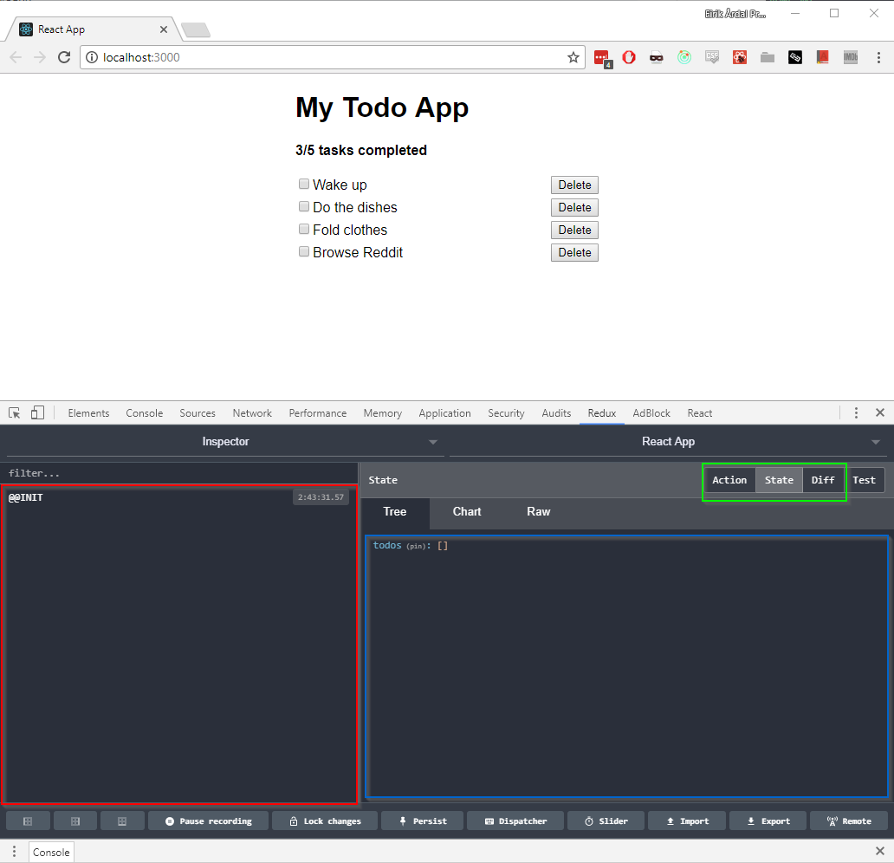

# Exercise 5 - Redux

## In this exercise you will learn:

- How Redux works.
- How to install Redux.
- The difference between _Container_ components that contains wiring and logic, and just plain _Components_ that just render DOM elements to the screen.
- How to map redux _state_ and _actions_ to React component props.
- Implement a Redux reducer and an action.
- Basics of Redux dev tools.

## Reminder: Todo app spec

Here's the spec for our todo app as discussed in the previous exercise, for reference.


### Header

- There will be an `h1` header for the name of this glorious app
- There will be a sub-header with slightly emphasized text stating how many total tasks there are and how many of those are completed.

### Adding a task

- There will be a textbox where a user can enter the description of a task
- There will be an "Add" button which will add the task to the list of existing tasks/todos.

### Listing todos

- There will be a list of todo items. Each todo item will consist of:
  - A checkbox with the description of the todo
  - An delete button which will remove the todo item permanently


1. `App`. Will contain the header text and the sub-components.
1. `Summary`. Will contain the total number of tasks and show how many of those are completed.
1. `AddTodo`. Will contain the textbox and Add-button.
1. `TodoList`. Will contain the list for all todo items.
1. `TodoItem`. Will contain a checkbox that marks a task as In Progress or Done, and a Delete button.

## 4.1 - Redux in a hurry

> :exclamation: Please just read this section. We'll implement the examples into our app in the next sections.

At the moment our application is only a composition of visual elements. All data so far is hard-coded into our app. Unfortunately, any real-world app needs to handle data, and there are many, many ways of approaching this problem.

Redux is currently one of the most popular solutions. It has nothing to do with React and can be used with Angular and other SPA frameworks, or alone. However, because of it's event-like, one-directional handling of state mutation, it is a particularly good fit with React.

Redux is a _state container_. All state that needs to be shared between components in our application will live and be maintained in Redux. Remember that React also has built-in internal state in class components. Sometimes, all you need is internal state, in which case you should use that mechanism and not Redux. Learning when to use which mechanism is one of the learning curves with this stack.

### Understanding Redux


Let's say we have an _Add_-button to add a new todo item. Adding this new todo item to the list of todo items would look like this:

1. The function provided to the button's `onClick` handler would trigger an _action_. An action is just an object that has a identifiable `type` and whatever data you need to mutate the state based on that action. For adding a new todo item, we'll need an action that looks like this:

```js
const addTodo = description => ({
  type: "ADD_TODO",
  description
});

// Identical to:

function addTodo(description) {
  return {
    type: "ADD_TODO",
    description: description
  };
}
```

2. The Redux Store object provides an `dispatch` function. This function _dispatches actions to the store_ (who would've thought!). So now the _store_ receives the `addTodo` action.
3. The _store_ will have a set of _reducers_ connected to it. A _reducer_ is simply a function that is passed in the store's _current state and the new action we dispatched to the store_. A reducer will look like this:

```js
const todosReducer = (state = [], action) => {
  switch (action.type) {
    case "ADD_TODO":
      return; /* new state based on the received action */
    default:
      return state;
  }
};
```

A few things to note:

- The `state` parameter defaults to an empty array. We call this the _default state_ for this reducer.
- The switch cases can return whatever we want. It's up to us to define _how the action changes the state_.
- Since this is simply a function that takes the old state, an action, and returns the new state, it's very easy to test, reason about, and debug.
- There should be absolutely no side-effects in an reducer (i.e no network calls, no filesystem calls, no DOM event triggering, etc). All side effects should be in _actions_. Reducers simply act upon the result of actions and sets a new state based on it.
- Reducers should _never_ mutate the existing state object that's passed in as parameter. Instead, it should create and clone new state in order to define and return the new state.
- (We would of course put the action types such as `'ADD_TODO'` in constants so they can be reused and refactored safely across actions and reducers).

An implemented reducer for handling new todo items could look like this:

```js
const todosReducer = (todos = [], action) => {
  switch (action.type) {
    case 'ADD_TODO': {
      const newTodoId = todos.length + 1;
      return [
        ...todos,
        new Todo(newTodoId, action.description);
      ];
    }
    default:
      return todos;
  }
};
```

Again, note the following:

- Instead of mutating the existing state, we're returning _a new array_.
- We make good use of the JavaScript [spread syntax](https://developer.mozilla.org/en-US/docs/Web/JavaScript/Reference/Operators/Spread_operator) to make sure our new todo list contains everything in the old list, _plus_ our new todo item which we instantiate using the class we made earlier.

Now that we have set a new state based on the action we dispatched when the user clicked on the button, we must _connect our React component to the Redux state_. Thankfully, Redux provides the glue for this, we just need to apply it.

Using our todo app as the example, we would glue the pieces together like this:

> Again, just read along for now, we'll implement this properly later.

```jsx
import React from "react";
import { connect } from "react-redux";
import TodoList from "./TodoList";
import { deleteTodo } from "./todoActions";

const TodoListContainer = props => (
  <TodoList todoItems={props.todoItems} onDeleteTodo={props.onDeleteTodo} />
);

const mapStateToProps = state => ({
  todoItems: state.todos
});

const mapDispatchToProps = dispatch => ({
  onDeleteTodo: todoId => dispatch(deleteTodo(todoId))
});

export default connect(
  mapStateToProps,
  mapDispatchToProps
)(TodoListContainer);
```

So there's a few things going on here.

- We created a new React component called `TodoListContainer`. We'll get back to this in a minute.
- There are two new functions: `mapStateToProps` and `mapDispatchToProps`. Both has to do with connecting Redux to our React app.
- We import the `connect` function from the `react-redux` package. This function takes everything we've defined here and connects everything together.

#### `mapStateToProps`

This function receives `state` as the first parameter. `state` is the entire state-tree in Redux. We'll get back to this in a minute. The takeaway here is that we use the state-parameter to select what in our state-tree we want to send in as _props_ to our component. In this case, we know we defined the prop `todoItems` back in `TodoList.jsx`, so we _map the todo list in the Redux state-tree to the `todoItems`-prop_.

#### `mapDispatchToProps`

This function receives the `dispatch` function as the first parameter. As mentioned earlier when we explained actions, we use the `dispatch` function to dispatch actions (side effects) to the Redux store. In this example, we _map the `onDeleteTodo`-prop to a function that takes an todo-ID and dispatch the `deleteTodo` action to the store with that ID_.

If there are tiny explosions in your head right now, that's ok :) We'll get there!

#### Containers vs. Components

With the introduction of Redux, a naming convention of `FooContainer` and `FooComponent` was suggested by the community in order to separate the glue-logic from the visual DOM elements. Confusingly enough, they opted to use the _Component_ terminology for this as well, even though everything we make in React is already an "React Component"...

The TL;DR version is this:

- _Containers_ are concerned with how things work and connects, and does not render DOM layouts. We typically use this as the example above, to glue React and Redux together, then just pass everything over to an _Component_.
- _Components_ are concerned with how things look. They are typically as simple and stupid as possible, only receiving data through props and returns JSX.

In this workshop, we'll use the naming conventions used in the workshop authors' work projects. This is not necessarily how you'd see components named everywhere else, or an acknowledged community naming practice. Nonetheless, we find it to be declarative and working well:

- We'll name _Containers_ using the _Container_ suffix, and _Components_ without any suffix. For example the `TodoListContainer`_-component_ (tongue straight now!) wires up data for the `TodoList`_-component_, which will only receive props and render the list to the screen. The files on disk will be named accordingly: `TodoListContainer.jsx` and `TodoList.jsx`.

#### Spreading props

Because _Containers_ just passes props on to it's sibling _Component_, we can just pass all props on aswell:

```jsx
/* ... */

const TodoListContainer = props => <TodoList {...props} />;

/* ... */
```

This way we don't have to specify PropTypes validation, and we reduce boilerplate when adding new props in `mapState(..)` or `mapDispatch(..)`. This is, however, considered an anti-pattern by the community because it makes the code less explicit and harder to debug.

## 4.2 - Installing Redux in our app

`create-react-app` does not include Redux by default so we'll need to install it.

:pencil2: Stop the web server running the todo app and install `redux`, `react-redux` and `redux-thunk`:

```bash
$ npm install redux react-redux redux-thunk
```

- `redux` is the main Redux library.
- `react-redux` is a helper library providing glue between React and Redux.
- `redux-thunk` is a middleware library used for creating _async actions_. We'll explain this one later.

:pencil2: Create the new file `reduxStore.js` and copy & paste the following content:

```js
import { createStore, applyMiddleware, compose } from "redux";
import thunk from "redux-thunk";
import rootReducer from "./rootReducer";

const initialState = {};
const enhancers = [];

// If we're in development, enable the 'Redux dev tools' browser extension
if (process.env.NODE_ENV === "development") {
  const devToolsExtension = window.devToolsExtension;

  if (typeof devToolsExtension === "function") {
    enhancers.push(devToolsExtension());
  }
}

// Create and pass in all middleware we'll use. In our case, only 'redux-thunk'.
const composedEnhancers = compose(
  applyMiddleware(thunk),
  ...enhancers
);

// Create the Redux store
const store = createStore(rootReducer, initialState, composedEnhancers);

export default store;
```

> :bulb: Feel free to explore Redux more (such as its various middleware), but unfortunately we don't have time to explain the details at this time. For now, just know that this is where we create the Redux store and all Redux-related infrastructure.

:pencil2: Create the new file `rootReducer.js` and enter the following content:

```js
import { combineReducers } from "redux";
import todosReducer from "./todosReducer";

export default combineReducers({
  todos: todosReducer
});
```

As the name suggests, this is our application's _root reducer_, i.e. the top node of our state-tree. In this todo app we'll only need one reducer, but this is where we would connect all reducers we need to maintain our application's state if we had more than one.

Let's create our reducer next.

:pencil2: Create the new file `todosReducer.js` with the following content:

```js
const todosReducer = (todos = [], action) => {
  switch (action.type) {
    default:
      return todos;
  }
};

export default todosReducer;
```

The last piece is to initialize Redux when the app starts (i.e. make sure the `createStore` function in `reduxStore` is called on startup).

:pencil2: Open `index.js` and change its content to:

```js
import "./index.css";
import React from "react";
import { render } from "react-dom";
import { Provider } from "react-redux";
import store from "./reduxStore";
import App from "./App";

render(
  <Provider store={store}>
    <App />
  </Provider>,
  document.getElementById("root")
);
```

Importing `store` from `reduxStore` and using the `Provider`-component are the magic tricks here. Provider is the main entry point for connecting Redux with React.

:pencil2: Start the dev server again using `npm start`. Open the browser. There should be no warnings or errors in the browser console.

### Redux dev tools

In exercise 1 we installed the browser extension _Redux dev tools_. Let's see what it can do.

:pencil2: Open the browser dev tools (<kbd>F12</kbd>) and find the `Redux`-tab.

A rather complex-looking window should appear. If it says something like "Could not find local Redux store", something is wrong with your setup and you should contact an instructor. Most likely, something is wrong in `reduxStore.js`.



The left-side panel (red) is a list of all actions that has been dispatched to the store. We'll explore this is in more detail when we implement actions.

The right-side panel (blue) displays the state. At the moment we have just defined an empty list of `todos` (remember, in `todosReducer`, we set the default reducer state to an empty array: `todos = []`, and in `rootReducer` we mapped the `todos`-property to the `todosReducer`, thus creating the _node in the state tree_ `todos: []`). Note the `Tree`, `Chart`, and `Raw` tabs. We'll just use the `Tree`-view, but others may be interesting with big applications.

The top-right button group (green) toggles between viewing the details of an action (that you select in the left-hand list), showing the state-tree (current, and default view), and inspecting the diff between the old and new state caused by an action.

The buttons at the bottom are for special and advanced use cases and can be safely ignored for now.

We'll explore this extension more as we go along. For now, let's get on with our app.

### [Go to exercise 5 :arrow_right:](../exercise-5/README.md)
