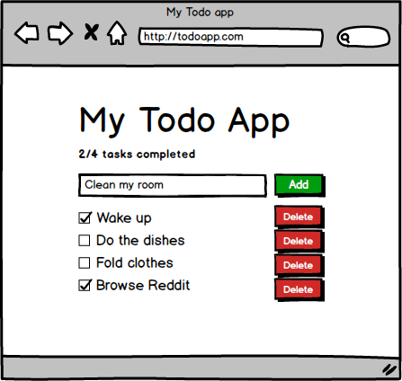
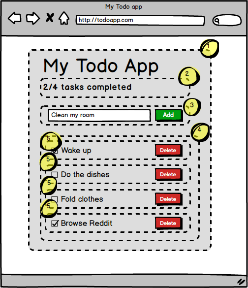
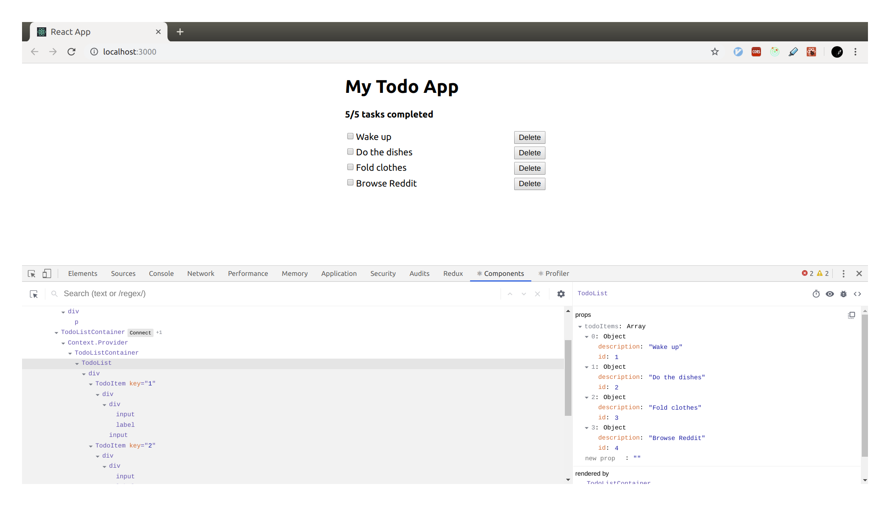

# Exercise 5 - Using Redux in our Todo app

## In this exercise you will learn to:

- Implement reducer and action in the Todo app.
- Connecting redux state and dispatching actions in a container component.
- Implement a React lifecycle method.
- Dispatch actions for creating initial todo items in the lifecycle method `componentDidMount`.

## Reminder: Todo app spec

Here's the spec for our todo app as discussed in the previous exercise, for reference.



### Header

- There will be an `h1` header for the name of this glorious app
- There will be a sub-header with slightly emphasized text stating how many total tasks there are and how many of those are completed.

### Adding a task

- There will be a textbox where a user can enter the description of a task
- There will be an "Add" button which will add the task to the list of existing tasks/todos.

### Listing todos

- There will be a list of todo items. Each todo item will consist of:
  - A checkbox with the description of the todo
  - An delete button which will remove the todo item permanently



1.  `App`. Will contain the header text and the sub-components.
1.  `Summary`. Will contain the total number of tasks and show how many of those are completed.
1.  `AddTodo`. Will contain the textbox and Add-button.
1.  `TodoList`. Will contain the list for all todo items.
1.  `TodoItem`. Will contain a checkbox that marks a task as In Progress or Done, and a Delete button.

## 5.1 - Moving the initial Todo list to Redux

At the moment we create a list of dummy todos in `App.jsx`. The goal now is that Redux will own all state and operations that mutate that state in the application, primarily the list of todos.

:pencil2: The easiest solution for now is to just cut the list from `App.jsx` and paste it in as the default state in `todosReducer`.

Now the state exists in Redux but we have yet to connect that state to our React components.

:pencil2: Create a new file `TodoListContainer.jsx`.

Let's write it out step by step.

1.  :pencil2: Import React and the magic glue from Redux to connect the state with the component. We also need our _Component_ that knows how to render out the todo list:

```jsx
import React from "react";
import { connect } from "react-redux";
import TodoList from "./TodoList";
```

2.  :pencil2: Next, we create the _Container_-component:

```jsx
const TodoListContainer = props => <TodoList {...props} />;
```

3.  :pencil2: Now for the Redux magic to select what React _props_ we want to map to what Redux _state_. Remember, the `TodoList` expects an `todoItems` _prop_ of type array that contains instances of `Todo` class instances.:

```js
const mapStateToProps = state => ({
  todoItems: state.todos
});
```

4.  :pencil2: Next, we _connect_ the _TodoListContainer_ and the _mapStateToProps_ together. Note that we just pass `null` as `mapDispatchToProps` because we don't have any functions to connect yet. You can leave the parameter unset/undefined if you want.

```jsx
export default connect(
  mapStateToProps,
  null
)(TodoListContainer);
```

5.  :pencil2: Finally, we have to use the _TodoListContainer_ component in our _App_ instead of the _TodoList_ component. Open _App.jsx_ and import and use _TodoListContainer_ instead of _TodoList_. Since the _TodoListContainer_ component now takes care of loading the list of _todoItems_, this prop can be removed. Using this component should be as straight-forward as `<TodoListContainer />`.

:pencil2: Make sure the list of todos still renders in the browser.  
:pencil2: Keep _Redux dev tools_ open in Chrome. Use the `State` and `Tree` modes and verify that the `todos` node in the state inspector now has the list of todos.

## 5.2 - Initial data by dispatching actions

Now that we have moved initial state to Redux, the next goal is to implement the whole Redux chain: Dispatching an `createTodo` action that is received and handled in the reducer and then added to the list and displayed in the GUI.

Remember this one-way data flow:


The first step, so we can slowly get familiar with Redux, is to dispatch one `createTodo` action for each initial todo we have hard-coded into the reducer so far.

:pencil2: Create a new file `todoActions.js`.  
:pencil2: Create the `createTodo` action:

```js
export const createTodo = description => ({
  type: "CREATE_TODO",
  description
});
```

:pencil2: Open `todosReducer.js` and add a new `case` that handles the `CREATE_TODO` action type.  
:pencil2: Implement the case for `CREATE_TODO`. Make the new state be the existing list of todos plus the new one contained in `action.description`. You can use the code examples in exercise 4 if you're stuck (but please try first).

> :exclamation: Remember to avoid modifying the existing state/list of todos. You want to create a new list containing copies of the items plus the new todo item.

### Dispatching actions when a component mounts

The last thing is that we must dispatch actions from an React component when it initially mounts in order to get the todos created. To do that, we need to make use of React's _lifecycle methods_.

React components have various lifecycle methods (see [this diagram](http://projects.wojtekmaj.pl/react-lifecycle-methods-diagram/) for a visual representation). From the React docs:

> ### The Component Lifecycle
> Each component has several “lifecycle methods” that you can override to run code at particular times in the process. In the list below, commonly used lifecycle methods are marked as **bold**. The rest of them exist for relatively rare use cases.
>
> #### Mounting
>These methods are called in the following order when an instance of a component is being created and inserted into the DOM:
>
>- **`constructor()`**
>- `static getDerivedStateFromProps()`
>- **`render()`**
>- **`componentDidMount()`**
> #### Updating
> An update can be caused by changes to props or state. These methods are called in the following order when a component is being re-rendered:
>
>- `static getDerivedStateFromProps()`
>- `shouldComponentUpdate()`
>- **`render()`**
>- `getSnapshotBeforeUpdate()`
>- **`componentDidUpdate()`**
>
>#### Unmounting
>This method is called when a component is being removed from the DOM:
>
>- **`componentWillUnmount()`**

The most used lifecycle method is `componentDidMount`. Dispatching actions from this method is the recommended way to fetch initial data and do whatever else is needed to get the component up and running.

Remember that we want _stuff related to how things work_ in Container-components and _stuff related to how things looks_ in plain, dumb, Component-components. That means we want to implement `componentDidMount` in `TodoListContainer`.

Lifecyle methods can only be implemented in React class components and not in pure components (because a pure component is just a plain function which cannot have additional functions.

> :bulb: However, never versions of React [have a feature called _Hooks_](https://reactjs.org/docs/hooks-intro.html). _Hooks_ will enable you to use React's state and lifecycle features in components  _without writing a class_. This feature is beyond the scope of this workshop, but may be covered in the future.

:pencil2: Refactor `TodoListContainer` to be a React class component instead of a pure component:

```js
import React, { Component } from "react";
import TodoList from "./TodoList";

class TodoListContainer extends Component {
  componentDidMount() {}

  render() {
    return <TodoList {...this.props} />;
  }
}
```

But how do we get the `createTodo` action we made earlier into `componentDidMount` so we can dispatch it? By using `mapDispatchToProps`.

:pencil2: Import the `createTodo` action from `todoActions.js` and connect it using _mapDispatchToProps_.

```js
import { createTodo } from './todoActions';

/* ... */

const mapDispatchToProps = dispatch => ({
  createTodoItem: description => dispatch(createTodo(description));
});

export default connect(
  mapStateToProps,
  mapDispatchToProps,
)(TodoListContainer);
```

Now we'll get this function available as the _prop_ named `createTodoItem` and we can simply call this function with a description to create new todos.

Full `TodoListContainer` at this point. Please write it out yourself and don't copy & paste:

```jsx
import React, { Component } from "react";
import PropTypes from "prop-types";
import { connect } from "react-redux";
import TodoList from "./TodoList";
import { createTodo } from "./todoActions";
import Todo from "./Todo";

class TodoListContainer extends Component {
  componentDidMount() {
    this.props.createTodoItem("Wake up");
    this.props.createTodoItem("Do the dishes");
    this.props.createTodoItem("Fold clothes");
    this.props.createTodoItem("Browse Reddit");
  }

  render() {
    return <TodoList todoItems={this.props.todoItems} />;
  }
}

TodoListContainer.propTypes = {
  todoItems: PropTypes.arrayOf(PropTypes.instanceOf(Todo)).isRequired,
  createTodoItem: PropTypes.func.isRequired
};

const mapStateToProps = state => ({
  todoItems: state.todos
});

const mapDispatchToProps = dispatch => ({
  createTodoItem: description => dispatch(createTodo(description))
});

export default connect(
  mapStateToProps,
  mapDispatchToProps
)(TodoListContainer);
```

You should now see the same list of todo items render in the browser with no errors. It may not look like much progress in the GUI, but who cares about that, right?! As we all know, the important stuff is what happens in the dev tools :satisfied:

> :exclamation: Remember to remove the default todo items in `todosReducer` and make the default state be an empty array again.

:pencil2: Open _Redux dev tools_ and inspect the left-hand panel. It should now contain 4 `CREATE_TODO` actions (or however many actions you dispatched).  
:pencil2: As you select each action (while in the `Diff` mode), notice how the main panel shows how the state changed when that action was received and reduced in the store. This gets more interesting when we start editing individual properties in exisiting objects and other more complicated operations.  
:pencil2: Switch to `Action` mode and see that you can inspect the action that was dispatched in detail.  
:pencil2: Click actions in the left-hand panel and note the small `Jump|Skip` buttons to the right in each list entry. Click _Jump_ and see how the GUI now shows _how the app looks while in the state up until that point_.

Pretty powerful debugging tools and extremely useful for understanding how state changes impacts your application :muscle: :heart_eyes:

:pencil2: Play around with Redux dev tools and the different modes and inspectors. See what it can do and show you.

Speaking of dev tools, now that our app has grown a bit, let's give _React dev tools_ another try.



:pencil2: Open _React dev tools_ in Chrome. Expand the Component Nodes in the main window a bit. Note how you can see each component as it appears in code, with correct props as they appear in code.  
:pencil2: Find the `TodoList` in the tree and select it. Inspect the right-hand panel and note that you can inspect the props it receives in detail. This is very useful when you just want to inspect all props the component actually receives at runtime, and what values they are.

### [Go to exercise 6 :arrow_right:](../exercise-6/README.md)
